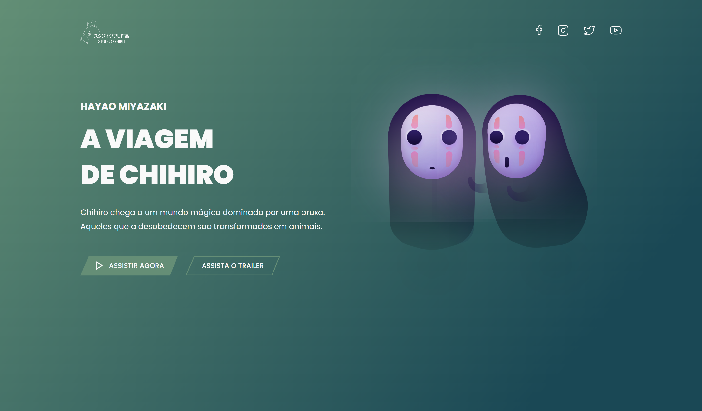
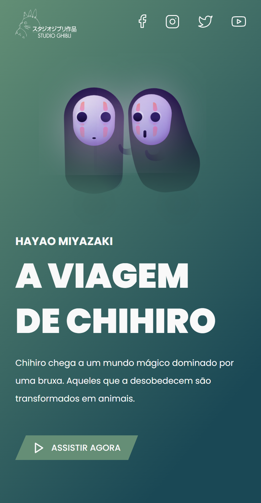

# A Viagem de Chihiro | Desafio 05 - Codelândia
## :dragon: **Projeto**

Esta é uma pequena Landing Page desenvolvida no desafio 05 da Codelândia, proposto pelo [Iuri Silva](https://github.com/iuricode).

<p align="center">
   <a href="https://spirited-away-liard.vercel.app">Veja o projeto completo aqui.</a>
</p>

## :art: **Visual do Projeto**
### *Desktop e Telas Maiores*
<h1 align="center">
    
</h1>

### *Mobile e Telas Menores*
<h1 align="center">
    
</h1>

## :straight_ruler: **Layout**

Você pode visualizar o layout do projeto clicando [aqui](https://www.figma.com/file/Yb9IBH56g7T1hdIyZ3BMNO/Desafios---Codelândia?node-id=39936%3A829&t=OlvqUx5LfvxOtN2n-0).

## :wrench: **Tecnologias**
Tecnologias utilizadas no projeto.
* HTML;
* CSS;
* JavaScript;
* [Node e NPM](https://nodejs.org/en/);
* [Vite](https://vitejs.dev);
* Visual Studio Code;
* Google Fonts.

## :rocket: **Configurações e Instalação**

Veja [documentação de configuração do Vite](https://vitejs.dev/config/).

### **Clonando o Projeto**

```sh
git clone https://github.com/davsilvam/spirited-away
```

### **Executando o Projeto**

```sh
npm install
```

### **Compilar e abrir para desenvolvimento**

```sh
npm run dev
```

### **Compilar e reduzir para produção**

```sh
npm run build
```

## :memo: **Licença**

Esse projeto está sob a licença MIT.

<p align="center">
  
</p>

<p align="center">
  Feito com :purple_heart: por <a href="https://www.linkedin.com/in/davsilvam/">David Silva</a>.
</p>

---
